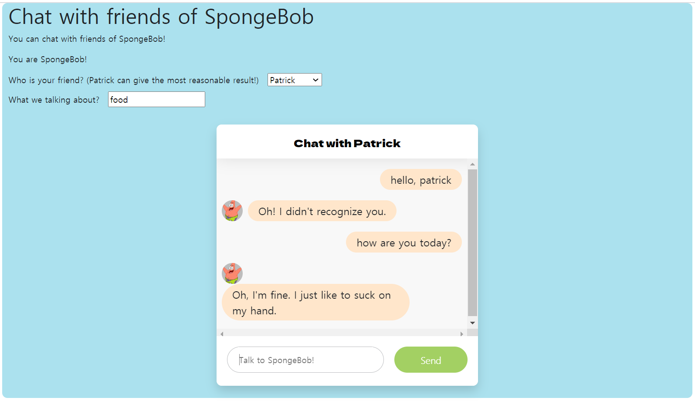

# Chat-with-SpongeBob
chatting app with SpongeBob characters using GPT2 open API

## About the Project
This service uses the following two open source APIs:
- GPT2-SpongeBob API: https://github.com/fpem123/GPT2-Spongebob
- Openchat API: https://github.com/fpem123/openchat
### Built With
* [Flask](https://flask.palletsprojects.com/en/2.0.x/)
* [Docker](https://docs.docker.com/get-started/)
## Web demo

https://main-chat-with-sponge-bob-ehgmsdk20.endpoint.ainize.ai/

## How to run
-----

### Docker build
```
cd /directory/where/dockerfile/is
docker build -t $(YOUR_DOCKER_HUB_ID)/ChatwithSponge .
```

### Docker run
```
docker run -p 80:80 -d $(YOUR_DORCKER_HUB_ID)/ChatwithSponge
```
Now the server is available at http://localhost.
